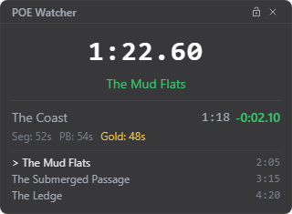
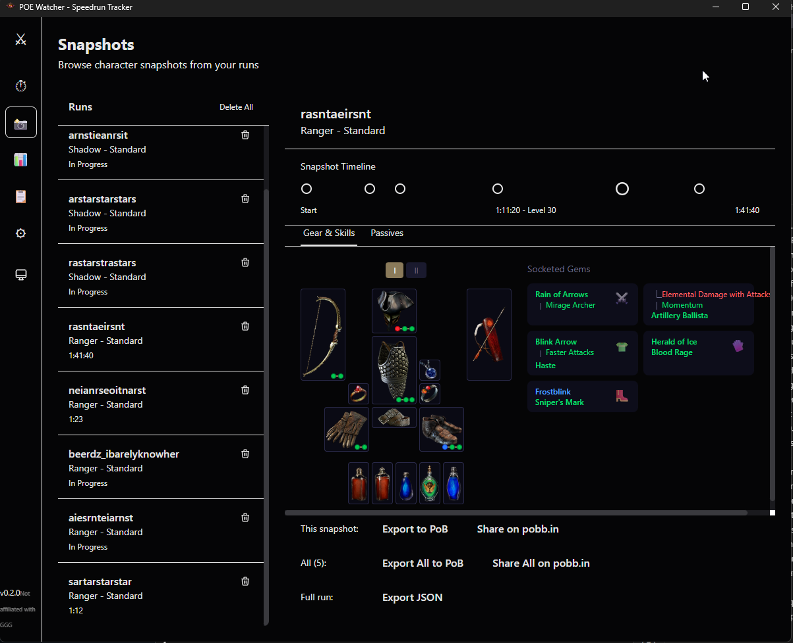
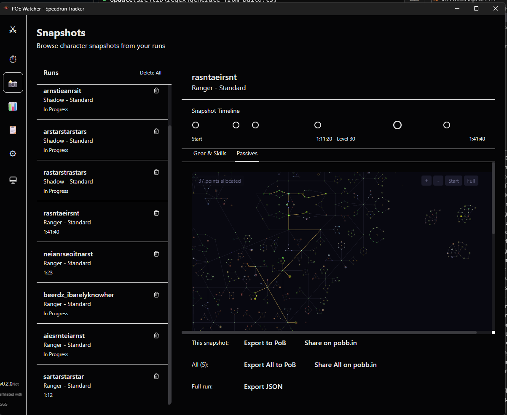

# PoE Watcher

A local desktop application for tracking Path of Exile speedruns. Monitor your gameplay, capture splits at key breakpoints, and analyze your builds with Path of Building integration.

## Features

### Timer & Splits
- **Live Timer** - Accurate speedrun timer with split tracking
- **Automatic Splits** - Triggers on zone changes, level milestones, act completions
- **Personal Bests** - Track and compare against your best runs
- **Gold Splits** - Best segment times highlighted in gold
- **Town/Hideout Time** - Tracks time spent in towns and hideouts separately
- **Global Hotkey** - Ctrl+Space to toggle timer from anywhere

### In-Game Overlay
- **Always-on-top overlay** - See your timer, splits, and upcoming breakpoints while playing
- **Live countdown** - Upcoming breakpoints show a live delta as you approach your PB pace
- **Customizable** - Adjust size, opacity, accent color, and which sections to show
- **OBS compatible** - Capturable via OBS Window Capture out of the box



### Character Snapshots
- **Auto-Capture** - Snapshots equipment, skills, and passive tree at each breakpoint
- **Timeline View** - Scrub through snapshots to see character progression
- **Equipment Grid** - Visual display of all equipped items with socket colors
- **Passive Tree** - Interactive visualization of allocated nodes
- **Skills Display** - Shows socketed gems grouped by item with link indicators





### Path of Building Integration
- **PoB Export** - Copy build code to clipboard for Path of Building
- **pobb.in Sharing** - Upload and share builds online
- **Multi-Snapshot Export** - Export all snapshots as PoB Loadouts
- **Proper Class Detection** - Correctly handles ascendancy detection from logs

### Run Management
- **Run History** - Browse all completed runs
- **Run Analytics** - Compare runs, view statistics
- **Reference Runs** - Set a run as reference for comparison
- **Bulk Delete** - Delete all runs at once

## Requirements

- Windows 10/11
- Path of Exile installed
- PoE profile set to **public** (for character data fetching)

## Installation

### From Release (Recommended)

1. Download the latest `.msi` or `-setup.exe` installer from [Releases](https://github.com/kburke8/poe-watcher/releases)
2. Run the installer

#### Windows SmartScreen Warning

Since the app is not code-signed, Windows will show a SmartScreen warning:

> "Windows protected your PC - Microsoft Defender SmartScreen prevented an unrecognized app from starting"

This is normal for unsigned applications. To proceed:
1. Click **"More info"**
2. Click **"Run anyway"**

The app is open source - you can review the code or build it yourself if you prefer.

#### Antivirus Notes

Some antivirus software may flag the app due to:
- File system monitoring (watching Client.txt)
- Global hotkey registration (Ctrl+Space)
- Network requests (PoE API)

These are all legitimate features. You may need to add an exception in your antivirus software.

### From Source

See [CONTRIBUTING.md](CONTRIBUTING.md) for detailed build instructions.

## Configuration

1. Launch PoE Watcher
2. Go to **Settings** (gear icon)
3. Set your **Client.txt Log Path**:
   - Steam: `C:\Program Files (x86)\Steam\steamapps\common\Path of Exile\logs\Client.txt`
   - Standalone: `C:\Program Files (x86)\Grinding Gear Games\Path of Exile\logs\Client.txt`
   - Or click **Auto-detect**
4. Enter your **PoE Account Name**
5. Optionally set a **Test Character Name** for simulating snapshots
6. Configure breakpoints - enable/disable specific splits, toggle snapshot capture
7. Click **Save Settings**

## Usage

### Timer Controls

- **Start** - Begin timing a new run
- **Pause** - Pause the timer
- **Split** - Manual split (automatic splits trigger on zone changes)
- **Reset** - Clear current run
- **End Run** - Save completed run
- **Ctrl+Space** - Global hotkey to toggle timer

### Automatic Splits

The app monitors Client.txt for these events:
- Zone transitions (e.g., entering towns, boss arenas)
- Level milestones (configurable)
- Act completions
- Lab completions

### Snapshots

When snapshot capture is enabled for a breakpoint:
1. Split triggers on zone enter or level up
2. App fetches character data from PoE API
3. Equipment, skills, and passive tree are saved
4. View snapshots in the Snapshots tab

### Path of Building Export

From the Snapshots view:
- **Export to PoB** - Copies PoB import code to clipboard
- **Share on pobb.in** - Uploads build and opens in browser
- **Export All** - Creates multi-snapshot build with Loadouts
- **Share All** - Uploads all snapshots as one build

## Technology Stack

| Component | Technology |
|-----------|------------|
| Desktop Framework | Tauri 2.x |
| Frontend | React 19 + TypeScript |
| State Management | Zustand |
| Styling | Tailwind CSS v4 |
| Database | SQLite (rusqlite) |
| File Watching | Rust `notify` crate |

## Project Structure

```
poe-watcher/
├── src/                    # React frontend
│   ├── components/         # UI components
│   │   ├── Timer/          # Timer display and controls
│   │   ├── Splits/         # Split list and rows
│   │   ├── Snapshot/       # Snapshot viewer, equipment, passives
│   │   ├── Settings/       # Configuration UI
│   │   └── History/        # Run history and analytics
│   ├── stores/             # Zustand state stores
│   ├── hooks/              # Custom React hooks
│   ├── utils/              # Utilities (PoB export, etc.)
│   ├── types/              # TypeScript interfaces
│   └── config/             # Configuration files
├── src-tauri/              # Rust backend
│   ├── src/
│   │   ├── db/             # SQLite database
│   │   ├── api_client.rs   # PoE API client
│   │   ├── log_watcher.rs  # Client.txt monitor
│   │   └── commands.rs     # Tauri IPC commands
│   └── Cargo.toml
└── package.json
```

## OBS Overlay Setup

The overlay is OBS-compatible by default. To capture it in OBS:

1. **Open the overlay** in PoE Watcher (Settings > Overlay > Open Overlay, or press `Ctrl+O`)
2. In OBS, add a new **Window Capture** source
3. Select **"PoE Watcher Overlay"** as the window
4. Set **Capture Method** to **Windows 10 (1903 and up)**
5. Optionally check **"Client Area"** to crop out the window border

The overlay uses software rendering (`--disable-gpu`) so OBS can capture it reliably. Position and resize the overlay in-game by dragging it, then crop/scale the OBS source to fit your scene.

## API Rate Limiting

The app respects GGG's API rate limits:
- 5 requests/second with burst of 10
- Automatic retry with exponential backoff on 429 responses
- 30-second response caching

## Troubleshooting

### "Profile is private" error
Set your PoE profile to public at [pathofexile.com/account/privacy](https://www.pathofexile.com/account/privacy)

### Log file not found
Verify the path in Settings. The file must exist and be readable.

### Timer not starting automatically
Ensure the log watcher is running (check the status indicator in the app).

### Snapshots not capturing
- Verify your account name is correct in Settings
- Ensure character name is detected (shows in timer view)
- Check that the character exists on the PoE website

### Wrong class in PoB export
This is handled automatically - the app detects ascendancy from level-up events and derives the correct base class.

## Contributing

Contributions welcome! See [CONTRIBUTING.md](CONTRIBUTING.md) for:

- Development setup
- Building releases
- Code style guidelines
- Adding new features

## Disclaimer

PoE Watcher is not affiliated with or endorsed by Grinding Gear Games in any way.

## Support

If you find this useful, consider supporting development:

[](https://ko-fi.com/kburke8)

## License

MIT License
